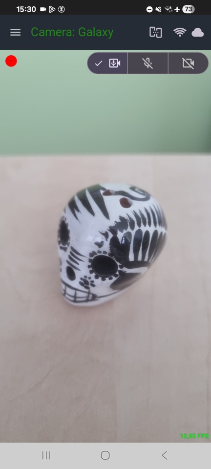
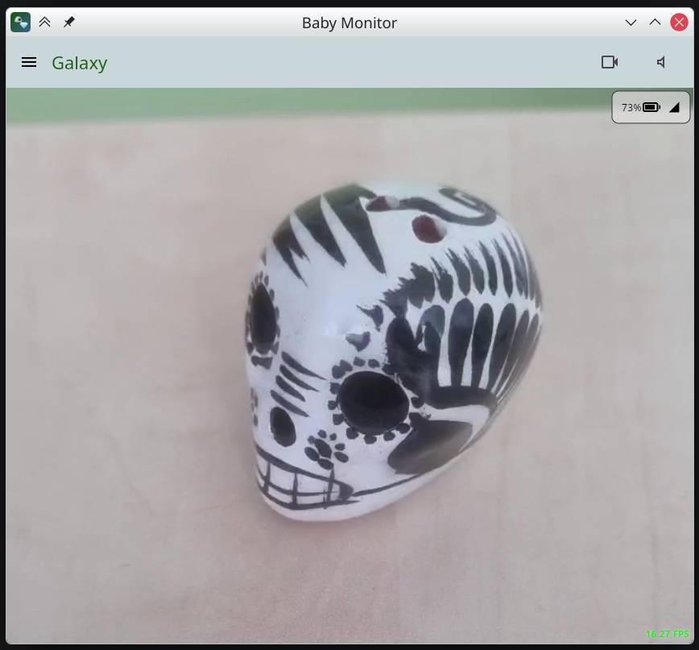
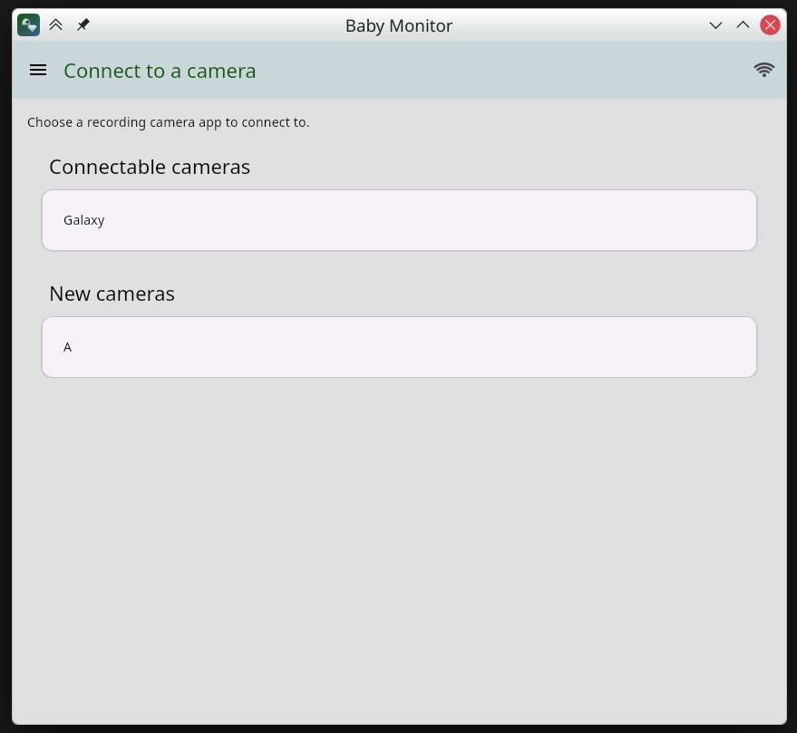
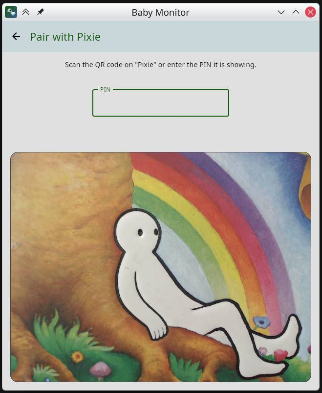
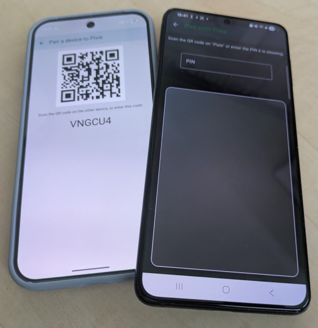

# Nanna Baby Monitor

This is a baby monitor app, with secure video and audio streaming, for Android and PC (using Java).
No accounts, no cloud servers, no telemetry, forever free and open source.

Nanna is "baby sleep" in Italian. But this is not just for babies! Watch your pets, your plants, your home, or anything else you want to securely and privately keep an eye on.

This app requires pairing between devices. Run the app in recording mode on one device (any Android 8+ device or a PC with a webcam). Using
a pairing code or a QR, pair it with another devices set to watching mode. Connect anytime to watch and/or listen.
Obviously, the recording device needs a camera and microphone, and the watching device needs a screen and optional speakers!

The app provides an optional relay application to allow paired devices to see each other from anywhere. Both recording and watching devices can be
then connected to from any network, they only need to be able to connect to the relay hostname/port.
The relay can be installed on a home server (with Dynamic DNS, e.g. duckdns.org, and with port `47814` forwarded to it), but also on a cloud
service if you have one.

# Features

- Secure video and audio streaming.
- Network discovery of recording apps on the same network.
- Secure pairing between devices, using a pairing code or QR code.
- Low light boost to see better in low light conditions.
- Silence detection to avoid sending audio when it's all quiet.
- Customizable recording quality.
- Draggable video feed to see the whole video feed on any screen.
- In theory, it works on any Android 8+ device and any computer (with a webcam, if you want to record from it).
- Supports multiple recording devices and multiple watching devices.
- Private, and without any cloud services or telemetry: it stays on your home's network.
- You can also run your own relay server, to allow devices to stream securely from anywhere to anywhere.

# Screenshots

| Recording on Android                                        | Watching on a PC                                          |
|-------------------------------------------------------------|-----------------------------------------------------------|
|  |  |

| Choosing a camera to watch                                  | Pairing a new camera                             |
|-------------------------------------------------------------|--------------------------------------------------|
|  |  |

Pairing two Android devices: the recording device shows the code, the watching device scans or types it.



# Installation

You can simply make debug builds from source.

```sh
git clone https://gitlab.com/vpilo/babymonitor.git
cd babymonitor
```

## Requirements

- To build: JDK 21 or later. Gradle downloads by itself the JetBrains Runtime 21 it builds with.
- To build the Android app: the Android SDK. Either install Android Studio, or set `ANDROID_HOME` to an SDK installed with the command line
  tools.
- To run the app: Android 8.0 (API 26) or later, or any PC with Java 21 or later.

## Android

```sh
./gradlew :appAndroid:assembleDebug
```

The APK is made as `appAndroid/build/outputs/apk/debug/org.vpilo.babymonitor-*-debug.apk`.
Copy it to the phone then open it, or install it with adb:

```sh
adb install -r appAndroid/build/outputs/apk/debug/org.vpilo.babymonitor-*.apk
```

`./gradlew :appAndroid:installDebug` builds and installs in one step on a device already connected to adb.

## Desktop

Build a self-contained jar and run it:

```sh
./gradlew :appDesktop:packageUberJarForCurrentOS
java -jar appDesktop/build/compose/jars/org.vpilo.babymonitor-*.jar
```

The jar embeds the FFmpeg native libraries, so it is large (around 130 MB) and only runs on the OS and architecture it was built on.
Build it on the machine that will run it. Only the native libraries of one platform are bundled, those of the host the build runs on.

To try a build without packaging it, run it directly with `./gradlew :appDesktop:run`.

Native installers (`./gradlew :appDesktop:packageAppImage`, `:appDesktop:packageDeb`) need a full JDK 21 including `jpackage` and the
`jmods` directory, already provided by the JetBrains Runtime that Gradle downloads. `packageDeb` additionally needs `dpkg` and `fakeroot`
installed on the build machine.

## Release builds

You can also make your own release builds, but to build the Android one, you'll have to create your own keystore (Android Studio: Build
menu > Generate Signed App Bundle or APK): use `./gradlew appAndroid:assembleRelease`.
Use `:appDesktop:runRelease` and `:appDesktop:packageReleaseUberJarForCurrentOS`) to build the optimized version, around 70 MB.

## Relay server

The relay is only needed to connect devices that are not on the same network. See the [relay README](appRelay/systemd/README.md) for
instructions on how to build and install it.

# Usage

## First run

Each device asks what it will do: record with its camera, or watch what another device is recording. The choice can be changed later from
the menu. Give a camera a recognizable name in the settings, so you can find it when there are more cameras running.

## Pairing

Devices must be paired once, and pairing can only be performed from the local network, for security.

1. On the recording device, open the menu and choose to pair a device. It shows a QR code and a six-character code, both valid for a short
   time.
2. On the watching device, pick the camera from the list of found cameras, then scan the QR code or type the code.
3. Repeat for every pair of devices. A recording device accepts several watchers, and a watcher can be paired to several cameras.

## Watching

Paired cameras appear in the list on the watching device, on the local network or, if a relay is configured, from anywhere. Choose one to
start streaming. The recording device shows its own viewfinder at all times, but only encodes and sends anything while somebody is
watching. It is best to turn the screen off on the recording device to save battery; the app will keep running in the background.

Audio and video can each be muted from either side, and the video feed can be dragged around to see all of it on a screen with a different
shape. Note that if you mute or blind the recording device, watchers will not be able to unmute or unblind it.

## Security and privacy

Pairings to clients can be revoked at any time from the camera app, and the client can likewise unpair cameras.

No accounts, no cloud services, no telemetry, no analytics: nothing leaves the devices except the streams, and only to devices that were
paired by hand.

Android permissions used by the app:

- `CAMERA`, `RECORD_AUDIO` - only requested on a recording device, and only for the modes in use.
- `FOREGROUND_SERVICE`, `FOREGROUND_SERVICE_CAMERA`, `FOREGROUND_SERVICE_MICROPHONE`, `FOREGROUND_SERVICE_MEDIA_PLAYBACK`,
  `POST_NOTIFICATIONS` - to keep recording or playing with the screen off, with the ongoing notification Android requires.
- `INTERNET`, `ACCESS_NETWORK_STATE`, `ACCESS_WIFI_STATE`, `ACCESS_LOCAL_NETWORK`, `CHANGE_WIFI_MULTICAST_STATE` - streaming, and the
  multicast traffic needed to find cameras on the local network.

No location permission is requested, and no permission is used for anything other than the above.

# Contributing

Issues and pull requests are welcome at [gitlab.com/vpilo/babymonitor](https://gitlab.com/vpilo/babymonitor).

[AGENTS.md](AGENTS.md) describes the module layout and the build commands.

# License

Nanna Baby Monitor is licensed under the [GNU Affero General Public License v3.0](LICENSE).

# AI disclaimer

This app is *not* vibe coded. If it were, there would be many more tests :grimacing:

As a new parent, without AI I would have never been able to get some features done to make the app publishable; while the most of the app
is my own, certain features were developed with the aid of AI tools: GPU-based camera processing, the initial relay app, the security
protocols, and pairing were all developed using Claude, then thoroughly reviewed and in some cases rewritten by me.
