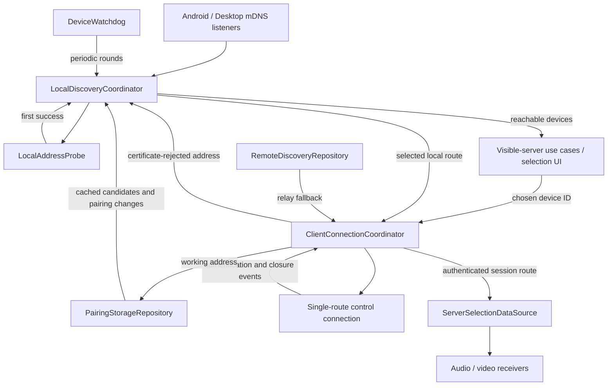

# Single-address devices and cached local discovery

## 1. Goal and agreed behavior

Replace the address collection exposed by `Device` with one nullable selected address. Discovery privately retains candidates, persists them for paired devices, and probes them without waiting for mDNS announcements. Classes and methods marked **new** below are proposed additions, not existing implementation.

| Behavior | Owner |
| --- | --- |
| One selected address, or no address | `Device` and **new** `DeviceAddress` in `model` |
| Candidates survive restarts | `PairedDevice`, `PairingStorageRepository`, `DefaultPairingStorageRepository` |
| Cheap TCP probes; first success wins, regardless of address family | **New** `LocalDiscoveryCoordinator` and `LocalAddressProbe` in `network:internal` |
| Immediate startup probing and periodic retries | Platform `DefaultLocalDiscoveryRepository` implementations and `DeviceWatchdog` |
| mDNS supplies candidates; probes determine camera availability | `AndroidDiscoveryListener`, `DesktopDiscoveryListener`, discovery coordinator |
| Alternative local addresses, then relay | **New** `ClientConnectionCoordinator` in `network:client` |
| Keep a working session on its route | Client coordinator and `ServerSelectionDataSource` |
| Delete certificate-rejected candidate; preserve pairing | Client coordinator, discovery coordinator, pairing storage |
| End an exhausted attempt; do not resume it on later discovery | Client coordinator and `CameraSelectionScreenViewModel` |

Save candidates even when they time out. Keep the latest advertised set and the last authenticated working local address; do not accumulate unlimited address history. The discovery-selected address and the active session's address are separate snapshots: discovery may update its selection without moving the working session.

## 2. Device model and address representation

### 2.1 `DeviceAddress` — new, `model`

Add `model/src/commonMain/kotlin/org/vpilo/babymonitor/model/DeviceAddress.kt`:

```kotlin
@Serializable
@JvmInline
value class DeviceAddress(val value: String)
```

- Require a nonblank host string, without scheme, port, or endpoint path.
- Local discovery constructs it from `InetAddress.hostAddress`, preserving IPv6 scope suffixes. Relay construction uses the configured hostname or IP literal.
- Construction, comparison, hashing, and serialization perform no DNS lookup. Socket code converts the string to a socket address only when probing or connecting.
- Pass the host string to Ktor as the current code passes `InetAddress.hostAddress`. Local and relay ports remain in `Constants`.
- `model` already applies Kotlin serialization and includes its dependency, so this type needs no new production dependency.

### 2.2 `Device` and subclasses — modify, `model`

In `Device.kt`, replace `addresses: Set<InetAddress>` with `address: DeviceAddress?`.

- `LocalServer` and `Client` take `address: DeviceAddress? = null`, preserving construction of local identities and paired-but-unavailable peers.
- `RemoteServer` and `Relay` require `DeviceAddress` in their constructors and may narrow their overridden address property to non-null. Remove the separate stored `relayHost` field and the synthetic `toAddressSet()`/`EMPTY_ADDRESS` implementation.
- Replace address-set comparison in `equals()` and `hashCode()` with the selected address. Retain existing class, ID, and name comparisons and name/ID ordering in `compareTo()`.
- Update `toString()` to describe one address or its absence rather than an address count.
- A new discovery selection creates a new device instance; it does not mutate a device retained by an active connection.

### 2.3 Constructors, previews, and relay consumers — modify

| Component | Change |
| --- | --- |
| `DefaultLocalClientDeviceRepository` (`data`) | Continue creating the local client identity with `address = null`. |
| `ServerHomeScreenViewModel` (`appCommon`) | Continue creating the local camera identity with `address = null`; advertising/listening does not require a selected peer address. |
| `PairedDevice.asServer()` / `.asClient()` | Continue returning addressless identity objects. Saved hints must not automatically produce a reachable device. |
| `makePreviewServer()` (`presentation`) | Replace the empty set with `null`; wrap the remote preview hostname in `DeviceAddress`. |
| `PairedDevicesScreen` previews and pairing tests | Update explicit address constructor arguments; ID/name-only construction stays valid. |
| `DeviceTransport` (`network:model`) | Encode the remote address string in the existing `id#relayHost#name` format; decode that field into `DeviceAddress`. The wire format stays unchanged. |
| `DefaultRemoteDiscoveryRepository` (`network:client`) | Compare remote address values with `RelayConfiguration.host` instead of reading `relayHost`. |
| `appRelay.Main` | Construct `Device.Relay` with `DeviceAddress(configuration.host)`. |
| `DefaultNetworkRelayRepository` (`appRelay`) | Compare registration and relay device address values; keep registration, rendezvous, and proxy behavior. |
| `RelayServerRegistration` (`network:server`) | Continue passing `RelayConfiguration.host` to the local server's transport encoder; this is the relay host, not the camera's local address. |

`RelayConfiguration.host` remains a settings string. Relay configuration, QR payloads, and application handshakes do not change format.

## 3. Candidate persistence

### 3.1 `PairedDevice` — modify, `network:model`

Add defaulted fields:

```kotlin
val knownLocalAddresses: List<DeviceAddress> = emptyList()
val lastWorkingLocalAddress: DeviceAddress? = null
```

`knownLocalAddresses` is the latest advertised local candidate set, represented by a deduplicated list. `lastWorkingLocalAddress` records the address used by the last authenticated local connection. Effective probe candidates are their union. Neither field indicates current availability, and neither stores a relay hostname.

Existing JSON records omit the fields and decode to their defaults. Keep storage in `Setting.PairedDevicesJson`; no new settings key or settings screen is needed.

### 3.2 `PairingStorageRepository` — modify, `network:model`

Add these suspend operations alongside existing pairing operations:

```kotlin
suspend fun updateKnownLocalAddresses(
    deviceId: DeviceId,
    addresses: Set<DeviceAddress>,
)

suspend fun recordWorkingLocalAddress(
    deviceId: DeviceId,
    address: DeviceAddress,
)

suspend fun removeLocalAddress(
    deviceId: DeviceId,
    address: DeviceAddress,
)
```

- Updating known addresses replaces the advertised set without clearing the last-working address.
- Recording success updates the last-working field; the effective union makes it an additional fallback even if a later announcement omits it.
- Removing an address deletes it from the advertised set and clears the last-working field if it matches.
- All three modify an existing pairing only. An absent pairing makes the update a no-op; late discovery work must not recreate it.

### 3.3 `DefaultPairingStorageRepository` — modify, `network:security`

Implement the new operations through the existing JSON storage. Put one repository-level `Mutex` around **all** read/modify/write mutations, including existing `pair`, `unpair`, and `updateName`. Read the latest list under the lock, modify only the requested record, and avoid a write when nothing changed.

Address updates preserve the certificate fingerprint and shared secret. Do not save on every successful watchdog probe: advertised-set changes cause writes; authenticated connections update the last-working address.

The discovery coordinator observes pairing-list changes. When an already-discovered camera becomes paired, copy its current advertised candidates into the new pairing so alternatives survive the first restart. Unpairing removes persisted hints; current mDNS state may still expose the device as a new, unpaired camera.

Cache hydration happens at startup. Later pairing-list emissions update pairing membership and working hints, but must not overwrite newer live advertised candidates with an older cached snapshot.

## 4. Shared local discovery

### 4.1 Proposed components — new, `network:internal`

| Component | Responsibility |
| --- | --- |
| `DiscoveredDeviceCandidates` | Internal parser output containing addressless local-server/client metadata and `Set<DeviceAddress>`. It is not itself a public connectable device. |
| `LocalDiscoveryCoordinator` | Own candidate records, selections, probe jobs, initial completion signals, pairing observation, and reachable-device output. Accept mDNS events, cache records, watchdog ticks, and connection feedback. |
| `LocalAddressProbe` | Injectable interface with `suspend fun acceptsConnections(address: DeviceAddress): Boolean`, allowing fake probes in tests. |
| `TcpLocalAddressProbe` | Production socket probe of `Constants.SERVICE_PORT` with the existing 2,000 ms timeout; no TLS/application handshake. |

A camera record contains metadata, advertised candidates, the last-working hint, its selected address, consecutive failed-round count, and candidate revision. A discovery-session generation distinguishes current work from callbacks belonging to a stopped/refreshed session.

Serialize record changes and publication through the coordinator. Platform listeners submit events instead of directly writing the visible `MutableStateFlow<Map<DeviceId, Device>>`. Probe workers run off the state-management context and return results tagged with session generation and candidate revision.

### 4.2 Platform parsers and listeners — modify

- Desktop `ServiceEventKtx.kt` and Android `NsdServiceInfoKtx.kt`: replace `toDeviceOrNull()` with `toDeviceCandidatesOrNull()`. Preserve service-type, schema-version, ID, name, and role validation. Return addressless device metadata plus the complete reported host set, converted to `DeviceAddress`. Remove Desktop's IPv6-first ordering.
- Preserve Android's API/extension check for `hostAddresses` and legacy single-host fallback. Candidate management only uses addresses the platform actually reports.
- `AndroidDiscoveryListener.onServiceResolved()` and `DesktopDiscoveryListener.serviceResolved()`: exclude the local device ID and submit candidate results to the coordinator. An empty host set does not create a reachable camera.
- `AndroidDiscoveryListener.onServiceLost()` and `DesktopDiscoveryListener.serviceRemoved()`: submit a loss event that triggers a probe. Do not directly remove visibility or erase candidates.
- Listener reset changes its registration/session identity. Shared-state clearing belongs to coordinator stop/start. Generation checks reject late Android resolution callbacks.

Only camera/server records are TCP-probed against the camera service port. Preserve handling of valid client-role announcements as metadata, without claiming that a monitor listens on that port. Cached paired peers are potential cameras until a current role announcement identifies them as clients.

### 4.3 `DefaultLocalDiscoveryRepository` — modify expect and both actuals

Extend its common expect constructor and both actuals to receive `PairingStorageRepository` and `LocalAddressProbe` alongside `CoroutineContext`. Android's context-taking constructor and Koin-backed secondary constructor forward these dependencies.

- Actual classes retain NSD/JmDNS setup, service attributes, Android multicast locking, registration state, and listener recreation.
- Delegate candidate handling, reachable-device output, and new query/feedback APIs to one coordinator owned by the repository.
- Client-side discovery starts cache loading and immediate probe batches alongside mDNS startup. Do not wait for a discovery callback or the first watchdog delay. Camera-role registration advertises identity without starting client probing.
- `unregister()` stops watchdog/coordinator jobs and pairing observation, closes owned probe sockets, and clears session output without deleting persisted hints.
- `refresh()` starts a new discovery/probe generation immediately, preserving saved candidates and current platform restart requirements.
- Remove `DISCOVERY_DEBOUNCE_TIME` from reachable-device output in both actuals and from the repository companion if unused. Keep deduplication and name/ID sorting; successful probes publish immediately.

### 4.4 `LocalDiscoveryRepository` — modify, `network:model`

Keep registration, refresh, and flow APIs; add:

```kotlin
suspend fun awaitInitialProbe(deviceId: DeviceId)

suspend fun selectLocalServer(
    deviceId: DeviceId,
    excludedAddresses: Set<DeviceAddress> = emptySet(),
): Device.LocalServer?

suspend fun rejectLocalAddress(
    deviceId: DeviceId,
    address: DeviceAddress,
)
```

- `awaitInitialProbe` waits for cache hydration and that peer's initial batch to find a winner or finish unsuccessfully. With no candidates it completes immediately after hydration. Discovery shutdown cancels waiting calls rather than leaving them suspended.
- `selectLocalServer` returns a probe-confirmed device for that ID, never an excluded address. Join the relevant in-flight batch or consume its current result. When connection failure excludes the selected address, probe remaining candidates and return their first success or `null` when exhausted.
- Initial route selection consumes the startup batch's result rather than repeating a failed batch and adding another two-second wait. Subsequent watchdog rounds and explicit candidate recovery provide fresh results.
- `rejectLocalAddress` removes the candidate from memory and current selection, invalidates results from the old candidate revision, and calls `PairingStorageRepository.removeLocalAddress`. Use it for certificate rejection; ordinary timeouts only exclude an address within the current attempt.
- Keep raw candidate collections private. Connection consumers receive a selected `LocalServer` or `null`.

### 4.5 Probe lifecycle and `DeviceWatchdog` — modify

Move the probing responsibility out of `Device.isReachable()` in `DeviceKtx.kt`; retain `Device.toAttributes()` there. The new probe implementation handles one `DeviceAddress`, and the coordinator races candidates.

- Probe peers independently and each peer's candidates concurrently. Complete its winner signal and publish on the first socket success. Do not delay publication until `awaitAll()` or return through a scope that first waits for its slow children.
- Close remaining sockets after choosing a winner. The production probe needs cancellation-driven socket closure and `use`/`finally` cleanup; cancelling a coroutine alone must not leave a blocking connect running until timeout.
- Validate session generation and candidate revision before accepting results. Stop, refresh, candidate replacement, and rejection invalidate old work.
- Convert `DeviceWatchdog` into a ten-second scheduler requesting coordinator probe rounds. Remove its separate `unreachableDevices` map of old device snapshots; the coordinator retains candidates for visible and unavailable peers.
- New/cache-loaded cameras stay absent until a probe succeeds. Previously visible cameras lose visibility after three consecutive all-candidate failed watchdog rounds; success resets the count.
- Explicit connection recovery bypasses that grace period for the failed/excluded selection, promptly enabling alternatives or relay fallback.
- Probe paired candidates for the whole active discovery session. Keep the existing 30-failed-round retention for unavailable unpaired discoveries, then drop them until a new announcement.

## 5. Connection selection, authentication, and recovery

### 5.1 `NetworkClientRepository` and `DefaultNetworkClientRepository` — modify

Change the public entry point to `suspend fun connect(deviceId: DeviceId)`. The user selects camera identity; route resolution no longer freezes a UI-provided `Device.Server` snapshot.

`DefaultNetworkClientRepository` remains the public facade, retaining its coroutine scope, foreground-service link, and public state flows. Delegate route orchestration to a new `ClientConnectionCoordinator`, replacing the captured-server reconnect loop and certificate-mismatch unpairing branch.

The coordinator receives local/remote discovery, pairing storage, session selection, and a single-route control connection factory. Expose its connection state through the facade; the facade starts foreground service participation for an attempt and stops it on terminal disconnection. Events identify the attempted route and attempt generation.

Add these internal transport components in `network:client`:

| New component | Interface and implementation |
| --- | --- |
| `ControlConnectionFactory` | `suspend fun open(route: Device.Server): ControlConnection`; start one route's transport without waiting for its complete session lifetime. |
| `ControlConnection` | `suspend fun awaitAuthenticated()`, `suspend fun awaitClosed(): Throwable?`, and `fun disconnect()`. Authentication completes only after the control session handshake; an earlier closure fails the authentication wait. |
| `WebSocketControlConnectionFactory` | Build `WebSocketConnectionHandler` with the route, pairing fingerprint, local identity, and relay configuration. Adapt its authentication/closure callbacks to the handle's completion signals. Tests replace the factory/handle with fakes. |

The coordinator waits for authentication before publishing session success, then observes closure for recovery. Completion signals retain their outcome so an early callback cannot be lost before a waiter starts. Disconnecting the handle cancels and cleans up its underlying handler.

### 5.2 `ClientConnectionCoordinator` — new, `network:client`

Own one attempt/session job, target device ID, attempted-local-address set, relay-attempt flag, and attempt generation. Serialize control/media failure events so simultaneous closures cannot start duplicate recovery jobs.

An attempt has this flow:

1. Load the chosen ID's pairing. If absent, terminate without opening a session. Its addressless `asServer()` supplies the initial `Connecting` state's identity.
2. Await that peer's initial cached probe and ask `selectLocalServer` for a route. The wait concerns only the chosen camera. No saved candidates means no cached-probe delay; freshly discovered candidates are also eligible.
3. Add a local address to the attempted set before connecting. Public state stays `Connecting` during initial fallback or `Reconnecting` during recovery; intermediate failures do not become terminal UI events.
4. Ordinary transport failure retains the saved candidate and selects another with the attempted set excluded. Certificate rejection calls `rejectLocalAddress` before selecting another. Even if mDNS re-adds the rejected address, this attempt cannot try it twice.
5. When no eligible local address remains, read current `RemoteDiscoveryRepository` output for that ID and try its relay route once. Read it directly: UI-visible-server deduplication may hide relay while a local entry exists.
6. Exhaustion clears session selection, stops the foreground link, and emits terminal `Disconnected`. Do not leave a waiting target that later discovery reactivates. Preserve certificate-mismatch reporting when that is the terminal cause; otherwise use the existing relevant failure reason.
7. Authenticated success publishes the exact session route, emits `Connected`, and records a successful local address if applicable. Continue using that route until failure or explicit disconnect.

An unexpected established control closure clears the active session route so media handlers stop, emits `Reconnecting`, and waits the existing `Constants.RECONNECTION_TIMEOUT` before one fresh bounded recovery attempt. That attempt can retry the former address but resolves current candidates; it does not recursively reconnect the captured device. Exhaustion ends recovery and returns to selection.

Existing pairing-revocation and device/relay protocol-version errors retain their terminal handling. Certificate rejection concerns the candidate and preserves the pairing.

**Proposed timeout defaults:** add a ten-second `CONTROL_CONNECTION_TIMEOUT` to `Constants` for local transport establishment through application authentication. The relay readiness deadline is `RELAY_HANDSHAKE_TIMEOUT + RELAY_RENDEZVOUS_TIMEOUT + CONTROL_CONNECTION_TIMEOUT` (35 seconds with current values), allowing its existing access/rendezvous stages. Apply the deadline to `awaitAuthenticated()` only, disconnect the handle on timeout, and classify it as an ordinary route failure. Never wrap the authenticated session's whole lifetime in this timeout.

`disconnect()`, `reset()`, or choosing another camera invalidate the generation and cancel that connection's pending work. Late callbacks cannot alter a new attempt or save its working address. Releasing connection-owned probe waits/requests does not stop shared background discovery.

Keep the existing `ConnectionState` variants and `Disconnected.additionalInfo`. `Connecting` may initially contain the chosen camera's addressless identity; `Connected` always contains its authenticated concrete route. Intermediate failures stay inside the attempt; `additionalInfo` retains the terminal cause for the existing error-details UI.

### 5.3 `WebSocketConnectionHandler` and control handshake — modify

- Remove `connect(remainingHosts)`, recursive `doConnect`, and the per-address attempt delay. Local connection requires one non-null `device.address` and uses its value. Remote connection retains its relay-access path and current configuration.
- Keep transport cancellation in `disconnect()`; route selection and route-level retries belong to the coordinator.
- Recognize certificate failures through the exception cause chain, because TLS errors may wrap `CertificateException`. Preserve cancellation as cancellation rather than a reachability failure.
- `ControlClientWebSocket.kt`: add an `onAuthenticated` callback immediately after `clientSessionHandshake` returns a cipher, before reading control messages. A null handshake result never calls it.
- `DefaultNetworkClientRepository`: remove the pre-handshake `onControlConnectionOpened(server)` call. Publish successful connection state from the authentication callback instead.
- `ClientSessionHandshake`, `ServerSessionHandshake`, and `PinnedTrustManager`: preserve their protocol, proof checks, and pinning. Add no server-ID greeting; wrong local certificates are rejected before the application handshake.

### 5.4 `ServerSelectionDataSource` and media receivers — modify

`ServerSelectionDataSource.server` continues to mean the authenticated active session route, not discovery's latest address. Only the client coordinator writes it: `null` during recovery, the actual route after authentication.

`DefaultIsConnectionAvailableRepository` can retain its `server != null` mapping: delaying session selection until authentication makes that existing flow represent actual authenticated availability.

`NetworkAudioReceiverRepository` and `NetworkVideoReceiverRepository` continue collecting it. Clearing selection stops their handlers; publishing a new authenticated route recreates both with the same address/relay and peer ID.

- Ordinary media-only transport failures retry the same active route after the existing delay while control is healthy. They do not independently select an address or relay.
- Media certificate rejection reports the active route/session generation to the coordinator. It deletes the candidate and starts coordinated recovery rather than repeatedly connecting to the rejected address.
- Cancellation from route replacement must not schedule a retry. Delayed callbacks check that their handler and session generation remain current.
- Discovery updates never write this data source. In particular, local discovery cannot migrate an established relay session.

## 6. Selection UI, pairing, and visible-device flows

### 6.1 `CameraSelectionScreenViewModel` — modify, `appCommon`

- Keep `ConnectToServer`'s displayed device as UI data, but call `networkClientRepository.connect(action.server.id)`. Repository-owned orchestration survives navigation to monitoring.
- Replace `waitForLastConnectedServer()`'s first-nonempty-list lookup with one startup attempt for the saved ID, provided it is paired. The coordinator handles cached probing and relay selection; an unrelated camera appearing first cannot abort that lookup.
- Keep existing `Setting.ClientLastServerId` preferences: successful connection records it, and existing terminal reasons that clear it continue doing so. Candidate persistence is independent of that setting.
- Navigate only for authenticated `Connected`. Candidate failures remain inside `Connecting`/`Reconnecting`; announce the error when the coordinator ends the attempt.
- Keep registering local client identity and refreshing discovery on the existing network-change signal; the discovery repository owns probe scheduling.
- After exhaustion, remain idle. New watchdog/relay results can enable the camera row, but do not retry the ended attempt.

`CameraSelectionScreenContent` uses device IDs for connecting-row identity checks where full device equality would otherwise lose the spinner on an address change. `ClientHomeScreenViewModel` continues displaying `Reconnecting` and emits its existing disconnected effect only on terminal `Disconnected`.

### 6.2 Visible/paired server use cases — modify or verify, `network:model`

- `GetVisibleServersFlowUseCase` retains local-over-relay display for matching IDs. Local cameras now arrive probe-confirmed; defensively exclude local entries with null addresses from connectable presentation.
- `GetConnectableServersFlowUseCase` still restricts visible entries to paired IDs; `GetNewServersFlowUseCase` still exposes unpaired, probe-confirmed local cameras for pairing.
- `GetPairedServersFlowUseCase`, `GetPairedDevicesFlowUseCase`, and `GetPairedNonVisibleServersFlowUseCase` retain addressless paired identities. They never turn saved hints into visibility.
- Client route selection reads relay discovery directly, independently of this UI deduplication.

### 6.3 Pairing — modify `DefaultClientPairingRepository` and `ClientPairingScreenViewModel`

`DefaultClientPairingRepository.pairWith()` becomes a single-address operation. Reject remote servers/null local addresses, create one pinned/TOFU client as today, and connect `/pair` using `DeviceAddress.value`. Remove iteration over `server.addresses`; preserve PIN confirmation, QR fingerprint checking, failure classifications, and cancellation.

`ClientPairingScreenViewModel` owns local-only fallback for a submitted PIN/QR operation. Track attempted addresses and ask `LocalDiscoveryRepository.selectLocalServer` for another only on the existing generic `CONNECTION_FAILED` outcome. Wrong PIN, QR fingerprint mismatch, inactive pairing window, version mismatch, and other semantic failures stay terminal. Pairing never falls back to relay.

Keep `InProgress` during this bounded operation and do not emit `ServerUnavailable` for a transient discovery update while selecting another candidate. Exhaustion reports the existing failure rather than waiting for new discovery indefinitely.

In `DefaultClientPairingRepository.handleServerConfirmation()`, put the attempted local address into the successful `PairedDevice` result as `lastWorkingLocalAddress`. `ClientPairingScreenViewModel` persists that result as today, and the discovery pairing observer seeds its complete advertised set. Camera-side `PairingCoordinator` keeps creating an addressless pairing for the monitor, since it has not learned the monitor's camera listening addresses.

## 7. Dependency injection, lifecycle, and data flow

- `NetworkInternalKoinModule`: bind `TcpLocalAddressProbe` as `LocalAddressProbe` and supply it plus `PairingStorageRepository` to the revised discovery constructor. The repository owns its coordinator instance.
- `NetworkClientKoinModule`: register the client coordinator and bind `WebSocketControlConnectionFactory` as `ControlConnectionFactory`; inject coordinator delegation into `DefaultNetworkClientRepository` and media failure reporting. Preserve singleton state. Avoid a DI cycle: the coordinator depends on neither the public client repository nor the media receivers.
- `NetworkSecurityKoinModule`: retain the existing pairing-storage binding, now implementing its extended interface.
- `NetworkModelKoinModule` and `KoinInitialization`: retain existing use-case/module composition, updating constructor arguments where required. `network:internal` depends on the pairing interface from `network:model`, not directly on `network:security`.
- Use existing literal logging tags. Log candidate changes, attempts, rejection, fallback, and terminal failure; avoid repeated unchanged watchdog successes and pairing secrets.



## 8. Verification and implementation order

### 8.1 Automated tests

| Suite/component | Required cases and assertions |
| --- | --- |
| `network:model` address/transport tests | Serialization preserves IPv4, scoped IPv6, and relay hosts; existing relay transport strings still decode; addressless identity is not connectable. |
| `DefaultPairingStorageRepositoryTest` (`network:security`) | Old JSON gets empty/null defaults; candidate replacement retains credentials/working hint; rejection clears matching fields; concurrent peer updates survive; late updates cannot recreate an unpaired record. |
| **New** `LocalDiscoveryCoordinatorTest` (`network:internal`) | Fake probes prove 50 ms success publishes before 2,000 ms failure for either family; cache-only startup works; peers publish independently; no-candidate initial completion follows hydration immediately. |
| Discovery watchdog/lifecycle tests | A camera starting later appears on a tick; responding cameras survive mDNS loss; three failed rounds remove visibility but retain saved hints; paired probing continues beyond 30 failures; unpaired candidates expire; stale results cannot survive stop/refresh/rejection. |
| **New** `ClientConnectionCoordinatorTest` (`network:client`) | Fake routes prove local alternatives then relay, one initial batch wait, at-most-once route attempts, and no premature terminal disconnection. |
| Authentication/recovery tests | Wrapped certificate failures delete only a candidate; failed authentication never selects a session or records success; readiness timeout closes transport but does not expire working sessions; exhausted attempts stay ended; working relay stays stable; recovery uses fresh candidates; cancellation/simultaneous failures cannot duplicate attempts. |
| `DefaultClientPairingRepositoryTest` and pairing fallback tests | Update address fixtures; generic failure can try another local candidate; semantic failures cannot; success saves actual address and seeds alternatives. |
| Selection startup tests/manual UI checks | Saved ID is targeted even if another camera appears first; spinner follows ID through address changes; exhaustion returns to idle; navigation does not cancel the repository-owned session. |

Use fake probes, connection events, and coroutine test scheduling for race tests rather than real LAN discovery or timing sleeps. Preserve real TLS/protocol regression coverage in existing security tests. Tests verify these state transitions, not merely constructor/property rewrites.

### 8.2 Build and runtime verification

Run affected desktop suites, including the new discovery suite, then the existing regression suites and full platform builds:

```sh
./gradlew :network:internal:desktopTest :network:model:desktopTest :network:client:desktopTest :network:security:desktopTest
./gradlew :errorreport:data:desktopTest :build-logic:test
./gradlew :appDesktop:desktopJar :appAndroid:assembleDebug :appRelay:compileKotlinDesktop
```

The relay compilation is included because its device construction/address comparisons change. Manually verify Android-to-Android, Desktop-to-Desktop, and cross-platform combinations: silent mDNS startup, camera starting later, IPv4-only/IPv6-only connectivity, network changes, relay fallback, and keeping an established session when local discovery arrives.

### 8.3 Suggested implementation sequence

1. Add `DeviceAddress` and pairing-storage fields/operations with migration/concurrency tests; these can precede removal of `Device.addresses`.
2. Add shared discovery coordination and the fakeable probe with race/lifecycle tests. Wire both platform adapters and watchdog into it.
3. Switch `Device` to one nullable address and update constructors, relay consumers, previews, pairing call sites, and the one-address WebSocket handler together.
4. Add bounded client coordination and post-handshake success publication. Update session/media recovery and VM startup/cancellation behavior.
5. Add pairing fallback/seeding; run affected suites and full builds, then the runtime checks above.

Each stage should leave tests and compilation passing. Combine stages 2 and 3 where switching the discovery model requires an atomic change.

**Boundary:** when all saved local addresses change and mDNS remains silent, the cache cannot discover an unknown address. A TCP-responsive candidate is provisional until actual authentication succeeds; an available relay remains the fallback.
